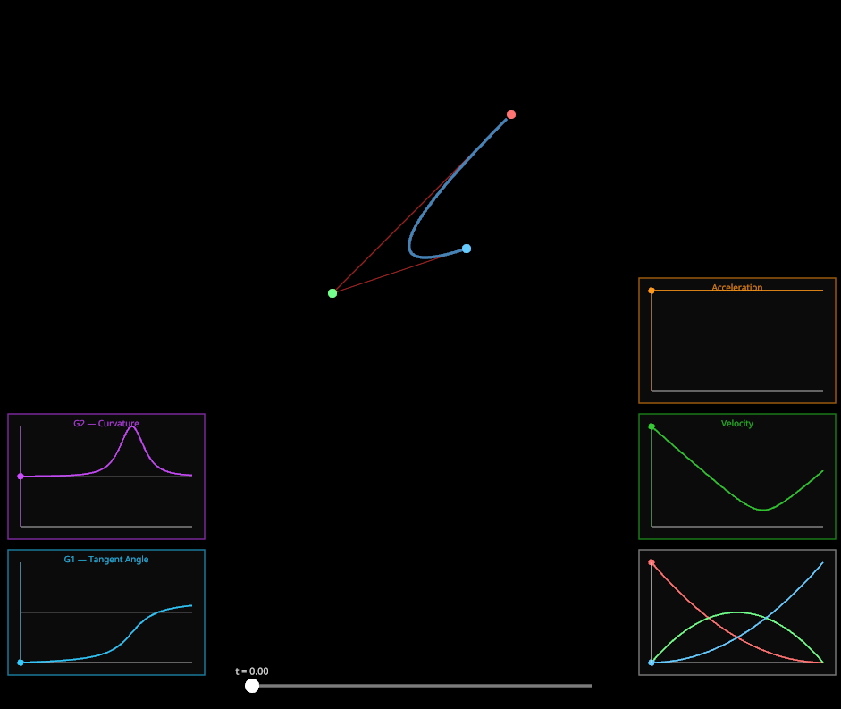

# Curve visualization

An interactive tool for exploring parametric curves — Bézier, piecewise spline, Hermite, and B-spline. Built with Rust and [nannou](https://nannou.cc/).

The point of this isn't to be a production spline editor. It's to make the math visible: basis functions, derivative graphs, continuity conditions — all updating live as you drag control points around.



## Building

Requires a recent stable Rust toolchain. nannou pulls in a few native dependencies (mostly graphics-related), so make sure you have the usual build tools for your platform.

```sh
cargo run
```

That's it.

## Controls

| Input | Action |
|---|---|
| Drag | Move a control point |
| Shift + click | Add a new control point |
| Space | Cycle through visualization modes |
| Slider (bottom) | Scrub the playhead along the curve |
| Drag tangent handle | Adjust tangent in Hermite mode |

## Modes

**Full Bézier** — one single Bézier curve through all control points. Degree grows with the number of points. The influence graph on the bottom-right shows the Bernstein basis functions.

**Piecewise Spline** — splits the control points into cubic segments sharing junction points (C0). Each segment gets its own color. Jump discontinuities in the velocity/acceleration graphs are marked in red.

**Hermite Spline** — cubic Hermite segments where you control both position and tangent at each point. Drag the yellow handles to adjust tangents. The basis function panel shows h00, h10, h01, h11.

**B-Spline** — clamped uniform cubic B-spline. Needs at least 4 control points. The influence graph shows the full set of Cox-de Boor basis functions, which is where the local control property becomes obvious.

## What's shown on screen

The panels on the right show velocity (speed magnitude) and acceleration along the curve, with red markers at any junction where continuity breaks down.

The panels on the left show G1 (tangent direction angle) and G2 (signed curvature).

The top corners show the overall continuity level of the current curve — **C0/C1/C2** (parametric) on the left and **G0/G1/G2** (geometric) on the right, colored green/yellow/red.

## Contributing

Issues and pull requests are welcome. If you're adding a new curve type or visualization, try to follow the pattern already in place: a self-contained module under `src/`, a rendering block in `view()`, and a `spans_to_bezier()` equivalent if you want the derivative graphs to work for free.

There's no roadmap or strict scope here, but a few things that would be interesting: NURBS, arc-length parameterization, curvature comb display, export to SVG.

## License

MIT — see [LICENSE](LICENSE).
